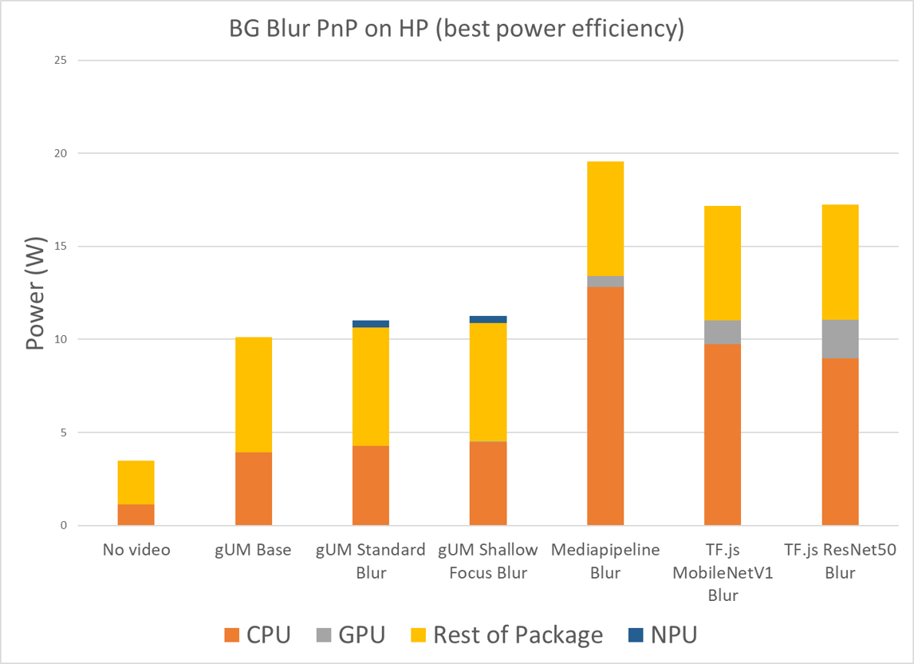

# Background Blur & Mask

## Authors:

- Rijubrata Bhaumik, Intel Corporation
- Eero Häkkinen, Intel Corporation
- Youenn Fablet, Apple Inc.

## Participate
- github.com/riju/backgroundBlur/issues/

## Introduction

Background Blur has become one of the most used features on Video conferencing web apps like [Teams](https://www.microsoft.com/en-us/microsoft-teams/virtual-meeting-backgrounds), [Meet](https://workspaceupdates.googleblog.com/2020/09/blur-your-background-in-google-meet.html), [Zoom](https://support.zoom.us/hc/en-us/articles/360061468611-Using-blurred-background-), [Webex](https://help.webex.com/en-us/article/0p4gb1/Webex-App-%7C-Use-a-virtual-or-blurred-background-in-calls-and-meetings), etc. We want to achieve the goal of giving all the Web apps similar levers as their native counterparts, leveraging the same platform APIs and to delight users without completely relying on ML frameworks like TensorFlow.js, [Mediapipe](https://ai.googleblog.com/2020/10/background-features-in-google-meet.html), etc, or cloud based solutions.

## Use Cases

A vast majority of communication these days happens on our client devices. During video meetings, participants are usually aware of how they look and what their environment (usually their home) is revealing to the audience. Most folks, especially ones without a dedicated office space would be inclined to hide messy rooms with pets and kids. Video meetings like face to face meetings are important for non-verbal communication but participants would rather focus on the important subject by removing the distractions in the background and prevent any accidental snafus. [Microsoft says](https://www.microsoft.com/en-ww/microsoft-365/business-insights-ideas/resources/how-custom-backgrounds-keep-the-focus-on-you) in a 38 minute conference call, 13 minutes are wasted dealing with distractions and interruptions. Background Blur goes a long way to cutting down those disruptions. [Zoom says](https://support.zoom.us/hc/en-us/articles/360061468611-Using-blurred-background)- "_When a custom virtual background is unavailable or not suiting your needs, but you still want to maintain some privacy with regards to your surroundings, the blur background option can be a great alternative. This option simply blurs the background of your video, obscuring exactly who or what is behind you. It's great for hiding a cluttered dorm room, taking a meeting in a coffee shop, or just keeping things professional._" . In fact, NCSC (National Cyber Security Centre UK) [suggests using background Blur or a background image](https://www.ncsc.gov.uk/guidance/video-conferencing-services-security-guidance-organisations) for staff meetings to add a degree of personal privacy.

On the Web, due to a lack of a standardized JS API for Background Blur and widespread demand, developers have no options but to use ML frameworks like Tensorflow.js and other WASM libraries to satify their customers. This Background Blur API gives developers a **choice** to use the native platform's API. This would ensure conformance to the corresponding native apps.


## Goals

* Ideally, Background Blur API should work with APIs like [Face Detection](https://github.com/riju/faceDetection/blob/main/explainer.md#goals). Face detection would help to either provide a [mask (countour) or at least the bounding box co-ordinates](https://github.com/riju/faceDetection/blob/main/explainer.md#face-detection-api) which might help Background Blur to compute faster. In many cases platforms will do an in-stream correction and explicit face detection might not be needed at the browser level. In that case the detectedFaces options can be nullable.

* Background Blur API should have options similar to what consumers demand, things possible on ML frameworks but not yet exposed by present day Platform APIs like Blur Level. Users might want to use blur intensity based on who they are communicating with.

* Background Blur API should work with [Workers](https://developer.mozilla.org/en-US/docs/Web/API/Web_Workers_API/Using_web_workers).

## Non-goals

One adjacent goal was to combine Background Replacement with Background Blur as part of an overall Background Concealment API. Presently there's no platform APIs to support Background Replacement (green screen, animated gif, image, video). Combining both might be too premature. Instead, we would like to keep Background Replacement as a separate feature proposal for a later date.

**Update:** Platforms have added APIs for **Background Segmentation MASK**, where we can get access to background mask metadata. Using this information, developers can create features like Green Screen and Transparent Background or other Background Replacement techniques.

## Performance

Background blur, using the proposed Javascript API, was compared to several other alternatives in power usage.
The results were normalized against base case (viewfinder only, no background blur) and are shown in the following chart.



* _Tool_ : Intel Power and Therman Analysis Tool (PTAT). 
* _Date of testing_  : May 2024
* _System configuration_ : HP Spectre x360 Intel Core Ultra 7 155H
* _Relevant testing/workload setup_  : 
640x480 pixel frame resolution
Windows > Settings > System > Power & battery > Power mode 
The tests were repeated at “Best power efficiency” power profile. 

[TF.js](https://storage.googleapis.com/tfjs-models/demos/body-pix/index.html) 

  -  Architecture: MobileNetV1 and Resnet50  
  -  Estimate: segmentation 
  -  Effect: bokeh 

[Mediapipe](https://storage.googleapis.com/tfjs-models/demos/segmentation/index.html?model=selfie_segmentation)

  -  Model: MediaPipeSelfieSegmentation 
  -  Visualization: bokehEffect 
  -  Runtime-backend: mediapipe-gpu  

Please check [Disclaimer](#disclaimer).

## User research

* TEAMS : Supportive. Let’s start with a MVP and add Background Replacement feature later.

*Agreed, [Background Replacement is now stated as Future Work](https://github.com/riju/backgroundBlur/blob/main/explainer.md#non-goals).
Some of the new features on Windows have [requirements](https://docs.microsoft.com/en-us/windows-hardware/drivers/stream/ksproperty-cameracontrol-extended-backgroundsegmentation#requirements) which might not be available to a lot of users right away, so we work on a minimal set which works on a broader set of clients and add newer features later.*


* MEET : Supportive, but Segmentation Mask is a basic building block in MediaPipe.

*We discussed that MASK would be more important in Background Replacement scenarios. Since no platform APIs support Background Replacement right now, we decided to move it to [future work](https://github.com/riju/backgroundBlur/blob/main/explainer.md#non-goals).*

* Zoom :

## Background Blur API

This is about bringing platform background concealment capabilities to the web so constrainable media track capabilities fit naturally to the purpose. Because the concealment is (or should be) implemented by the platform media pipeline, it is enough for a web application to control the concealment through constrainable properties. The application does not have to (and actually cannot) do the actual concealment in this case. The concealment is already done before the application receives video frames. On Apple devices, Background Blur is controlled globally from Command Center and as such any app cannot independently switch on/off the feature.

```js
partial dictionary MediaTrackSupportedConstraints {
  boolean backgroundBlur = true;
};

partial dictionary MediaTrackCapabilities {
  sequence<boolean> backgroundBlur;
};

partial dictionary MediaTrackConstraintSet {
  ConstrainBoolean backgroundBlur;
};

partial dictionary MediaTrackSettings {
  boolean backgroundBlur;
};
```

[PR](https://github.com/w3c/mediacapture-extensions/pull/61)

If a need for a more fine grained backgroud blur levels arises, the boolean _backgroundBlur_ constrainable property could be replaced with a DOMString _backgroundBlurMode_ constrainable property which could support values like `"off"`, `"light"` and `"heavy"`, for instance.

## Background Segmentation Mask API

This is about bringing platform background segmentation capabilities to the web so constrainable media track capabilities fit naturally to the purpose. Because the segmentation is (or should be) implemented by the platform media pipeline, it is enough for a web application to control the segmentation through constrainable properties. In this case, the application must do the actual concealment by itself based on normal and background mask video frames which can be classified as such using video frame metadata.

```js
partial dictionary MediaTrackSupportedConstraints {
  boolean backgroundSegmentationMask = true;
};

partial dictionary MediaTrackCapabilities {
  sequence<boolean> backgroundSegmentationMask;
};

partial dictionary MediaTrackConstraintSet {
  ConstrainBoolean backgroundSegmentationMask;
};

partial dictionary MediaTrackSettings {
  boolean backgroundSegmentationMask;
};

partial dictionary VideoFrameCallbackMetadata
  boolean backgroundSegmentationMask;
};

partial dictionary VideoFrameMetadata {
  ImageBitmap backgroundSegmentationMask;
};
```
## Blur vs Mask 
In terms of API shape, both the BG Blur and the BG MASK have similar (but separate) Media Stream Track Capabilities, Constraints and Settings. There is some implementation difference -

* BG Blur preprocesses video frames and replaces the original video frames with ones with background blurred thus the original video frames become unavailable from a web application point of view (until BG Blur is disabled) 

* BG MASK retains the original frames intact, does segmentation and provides mask frames in addition to the original video frames thus web applications receive both the original frames and mask frames in the same video frame stream (effectively doubling the frame rate) 

In BG MASK, web applications must be able to separate the original video frames from mask frames and for that, we are adding a boolean to VideoFrameMetadata. 

As an implementation detail, masks get interleaved in the stream, the order is first masked frame, then original frame. Could the actual frame be provided with metadata instead of providing it as a different frame.

TODO(eero) : Explore alpha channel. Webcodecs does not support alpha chanel today.

## Mask Data -- VideoFrame / ImageBitmap / ImageData
How to present the Mask data ? 
* **VideoFrame** : VideoFrame for WebCodec and HTMLVideoElement are the only elements supported by WebGPU zero copy path via [importExternalTexture](https://www.w3.org/TR/webgpu/#dom-gpudevice-importexternaltexture).  [WebCodecs integration](https://developer.chrome.com/blog/new-in-webgpu-116#webcodecs_integration) adds support for using a ```VideoFrame``` as the source for a [GPUExternalTexture](https://developer.mozilla.org/en-US/docs/Web/API/GPUExternalTexture) and a [copyExternalImageToTexture()](https://developer.mozilla.org/en-US/docs/Web/API/GPUQueue/copyExternalImageToTexture) call. 
  - Maybe not for majority users, but in some cases, with high resolution cameras, it's possible that the VideoFrame can be 4K and BG Segementation/Mask can be 4K too. Other than that, CPU residency is good enough.

[Elad](https://github.com/w3c/mediacapture-extensions/pull/142#discussion_r1600063736), [Jan-Ivar](https://github.com/w3c/mediacapture-extensions/pull/142#discussion_r1628541641) and [Eugene](https://www.w3.org/2024/06/18-mediawg-minutes.html#t04) think VideoFrame is not needed for this use case.
    

* **ImageData** or **ImageBitmap** has the same CPU back resource support.
  - ImageData has a data readonly attribute which is better than ImageBitmap. ImageBitmap always relies on others to readback contents.
  - ImageData requires data to be in RGBA format in an `Uint8ClampedArray` which always requires a conversion from a grayscale source.
  -	2D canvas also exposes a API named [putImageData()](https://developer.mozilla.org/en-US/docs/Web/API/CanvasRenderingContext2D/putImageData) to upload contents without conversions(e.g. alpha related ). ImageBitmap could only rely on the draw call and some conversions might happens (e.g. alpha)
  -	ImageBitmap has flexible support also for formats other than RGBA and also for GPU texture back resources.

Thanks @shaoboyan @eladalon1983 @Djuffin

## Exposing change of MediaStreamTrack configuration

The configuration (capabilities, constraints or settings) of a MediaStreamTrack may be changed dynamically outside the control of web applications.
One example is when a user decides to switch on background blur through the operating system.
Web applications might want to know that the configuration of a particular MediaStreamTrack has changed.
For that purpose, a new event is defined below.

```js
partial interface MediaStreamTrack {
  attribute EventHandler onconfigurationchange;
};
```

[PR](https://github.com/w3c/mediacapture-extensions/pull/61)

## Example

 * main.js:
   ```js
   // main.js:
   // Open camera.
   const stream = await navigator.mediaDevices.getUserMedia({video: true});
   const [videoTrack] = stream.getVideoTracks();

   // Use a video worker and show to user.
   const videoElement = document.querySelector('video');
   const videoWorker = new Worker('video-worker.js');
   videoWorker.postMessage({videoTrack}, [videoTrack]);
   const {data} = await new Promise(r => videoWorker.onmessage);
   videoElement.srcObject = new MediaStream([data.videoTrack]);
   ```
 * video-worker.js:
   ```js
   self.onmessage = async ({data: {videoTrack}}) => {
     const processor = new MediaStreamTrackProcessor({track: videoTrack});
     let readable = processor.readable;

     const capabilities = videoTrack.getCapabilities();
     if ((capabilities.backgroundBlur || []).includes(true)) {
       // The platform supports background blurring.
       // Let's use platform background blurring.
       // No transformers are needed.
       await track.applyConstraints({
         backgroundBlur: {exact: true}
       });
       // Pass the same video track back to the main.
       parent.postMessage({videoTrack}, [videoTrack]);
     } else {
       // The platform does not support background blurring or
       // does not allow it to be enabled.
       // Let's use custom face detection to aid custom background blurring.
       importScripts('custom-face-detection.js', 'custom-background-blur.js');
       if ((capabilities.backgroundSegmentationMask || []).includes(true)) {
         // The platform supports background segmentation mask.
         // Let's use it to aid face detection.
         await track.applyConstraints({
           backgroundSegmentationMask: {exact: true}
         });
       }
       const transformer = new TransformStream({
         async transform(frame, controller) {
           // Use a custom face detection.
           const detectedFaces = await detectFaces(
               frame,
               frame.metadata().backgroundSegmentationMask);
           // Use a custom background blurring.
           const newFrame = await blurBackground(frame, detectedFaces);
           frame.close();
           controller.enqueue(newFrame);
         }
       });
       // Transformer streams are needed.
       // Use a generator to generate a new video track and pass it to the main.
       const generator = new VideoTrackGenerator();
       parent.postMessage({videoTrack: generator.track}, [generator.track]);
       // Pipe through a custom transformer.
       await readable.pipeThrough(transformer).pipeTo(generator.writable);
     }
   };
   ```

## Background Segmentation Mask Example: Green Background
```js
window.addEventListener('DOMContentLoaded', async event => {
  const stream = await navigator.mediaDevices.getUserMedia({video: true});
  const [videoTrack] = stream.getVideoTracks();
  const videoCapabilities = videoTrack.getCapabilities();
  if ((videoCapabilities.backgroundSegmentationMask || []).includes(true)) {
    await videoTrack.applyConstraints({
      backgroundSegmentationMask: {exact: true}
    });
  } else {
    // No background segmentation mask support. Do something else.
  }
  const videoSettings = videoTrack.getSettings();
  const videoProcessor = new MediaStreamTrackProcessor({track: videoTrack});
  const videoGenerator = new MediaStreamTrackGenerator({kind: 'video'});
  const videoElement = document.querySelector('video');
  videoElement.srcObject = new MediaStream([videoGenerator]);
  await videoProcessor.readable
    .pipeThrough(new TransformStream({
      start(controller) {
        console.log('start');
        this.height = videoSettings.height;
        this.width = videoSettings.width;
        this.backgroundCanvas = new OffscreenCanvas(this.width, this.height);
        this.canvas = new OffscreenCanvas(this.width, this.height);
      },
      transform(videoFrame, controller) {
        const backgroundSegmentationMask =
            videoFrame.metadata().backgroundSegmentationMask;

        if (backgroundSegmentationMask) {
          const backgroundContext = this.backgroundCanvas.getContext('2d');
          const context = this.canvas.getContext('2d');

          // Draw a green background and a black foreground:
          // Invert and draw the mask frame.
          backgroundContext.globalCompositeOperation = 'copy';
          backgroundContext.fillStyle = 'white';
          backgroundContext.fillRect(0, 0, this.width, this.height);
          backgroundContext.globalCompositeOperation = 'difference';
          backgroundContext.drawImage(backgroundSegmentationMask, 0, 0);
          // Draw the background color.
          backgroundContext.globalCompositeOperation = 'multiply';
          backgroundContext.fillStyle = 'lime';
          backgroundContext.fillRect(0, 0, this.width, this.height);

          // Draw the foreground and a black background:
          // Draw the mask frame.
          context.globalCompositeOperation = 'copy';
          context.drawImage(backgroundSegmentationMask, 0, 0);
          // Draw the foreground from the video frame.
          context.globalCompositeOperation = 'multiply';
          context.drawImage(videoFrame, 0, 0);

          // Combine the foreground and the green background.
          context.globalCompositeOperation = 'lighter';
          context.drawImage(this.backgroundCanvas, 0, 0);
        } else {
          // Draw green.
          const context = this.canvas.getContext('2d');
          context.globalCompositeOperation = 'copy';
          context.fillStyle = 'lime';
          context.fillRect(0, 0, this.width, this.height);
        }

        // Create and enqueue a new video frame.
        const {timestamp} = videoFrame;
        videoFrame.close();
        controller.enqueue(new VideoFrame(this.canvas, {timestamp}));
      }
    }))
    .pipeTo(videoGenerator.writable);
});
```

## Demo
https://github.com/riju/backgroundBlur/assets/975872/27b320aa-ee66-48ee-968f-3f0a11c75d38

[Demo Page](https://github.eero.xn--hkkinen-5wa.fi/web-platform-demos/mediacapture/background-segmentation-mask/) by [@eehakkin](https://github.com/eehakkin)
Inspired by [webrtcHacks](https://github.com/webrtcHacks/transparent-virtual-background/tree/master), thanks [@fippo](https://github.com/fippo) and [@chadwallacehart](https://github.com/chadwallacehart)

#### Implementation Detail :
The demo uses transform streams to preprocess frames before displaying them on a video element. The demo always keeps the last mask frame but does not pass them to the video element (except for demo purposes). Whenever the demo receives an original video frame, the demo uses that frame and the last mask frame to create a new video frame with foreground colored with a foreground overlay color (blue by default) and enqueues that to be passed to the video element instead of the original (and the mask) frames.

## Security considerations

Background Blur feature does not expose any more security concerns compared to a video call without it. Since there's demand for Background Blur many products use a cloud based solution to satisfy conformance across a myriad of client devices. Modern clients are quite efficient these days to handle such popular tasks like Background Blur, either by leveraging AI accelerators or using specific vector instructions like AVX.

The support for background blur is a track invariant. Web applications cannot affect it. Tracks which originates from `MediaDevices.getUserMedia()` may support background blur if the selected camera and the platform support it. Tracks which originates from other sources do not support background blur.

The background blur capability (a boolean sequence describing whether it is possible to enable and/or to disable the background blur) is provided by the User-Agent and cannot be modified by web applications. It may however change for instance if the user uses operating system controls to enforce background blur or to remove such an enforcement.

The background blur constraints are provided by web applications by passing them to `navigator.mediaDevices.getUserMedia()` or to `MediaStreamTrack.applyConstraints()`. Constraints allow web applications to change settings within the bounds of capabilities.

The current background blur setting (a boolean describing whether background blur is currently in effect) is provided by the User-Agent. It may change if the user uses operating system controls to disable or to enable background blur but also if web applications uses `MediaStreamTrack.applyConstraints()` to select a supported background blur setting other than the current one. If the background blur capability does not include multiple supported boolean settings, web applications cannot change the background blur setting.

## Privacy considerations

Background Blur is supposed to enhance Privacy of the user compared to a video call without it. Many times users are in a video call where they do not know the audience well enough. It's advisable to not accidentally share any more personal information than required which might be otherwise be exposed without any form of Background Concealment. When in doubt, it's better to blur it out and users would change the blur intensity depending on who is on the other side of the call.

### Fingerprinting

If a site does not have [permissions](https://w3c.github.io/permissions/), background blur provides practically no fingerprinting posibilities.
The only provided information is `navigator.mediaDevices.getSupportedConstraints().backgroundBlur` which either is true (if the User-Agent supports background blur in general irrespective of whether the device has a camera or a platform version which support background blur) or does not exist.
That same information can most probably obtained also by other means like from the User-Agent string.

If a site utilizes `navigator.mediaDevices.getUserMedia({video: {}})` which resolves only after the user has [granted](https://w3c.github.io/permissions/#dfn-granted) the ["camera"](https://www.w3.org/TR/mediacapture-streams/#dfn-camera) permission, the returned video tracks may have `backgroundBlur` capabilities and settings.
The `backgroundBlur` capability can be either non-existing, `[false]`, `[true]` or `[false, true]` and the setting can be either non-existing, false or true.
Based on the capability, it is possible to determine if the platform is one which allows application only to observe background blur setting changes or one which allows applications also to set the background blur setting.
In essence, this splits operating systems to two groups but does not differentiate between platform versions.

All the frames for which background is blurred originate from cameras.
No methods are provided for sites to insert frames for background blurring.
As such, sites cannot fingerprint the background blur implementation as the sites have no access to original frames and have access to blurred frames only if the user has the user has [granted](https://w3c.github.io/permissions/#dfn-granted) the ["camera"](https://www.w3.org/TR/mediacapture-streams/#dfn-camera) permission.

## Stakeholder Feedback / Opposition

[Implementors and other stakeholders may already have publicly stated positions on this work. If you can, list them here with links to evidence as appropriate.]

- [Safari] : [Positive](https://lists.webkit.org/pipermail/webkit-dev/2022-July/032321.html) Youenn (Apple) is co-author.
- [Firefox] : [Positive](https://github.com/mozilla/standards-positions/issues/658#issuecomment-1477070865).

[If appropriate, explain the reasons given by other implementors for their concerns.]

## References & acknowledgements

Many thanks for valuable feedback and advice from:

- [Tuukka Toivonen]
- [Bernard Aboba]
- [Harald Alvestrand]
- [Jan-Ivar Bruaroey]
- [Youenn Fablet]
- [Dominique Hazael-Massieux]
- [François Beaufort]
- [Elad Alon]
- [Shaobo Yan]


## Disclaimer

Intel is committed to respecting human rights and avoiding complicity in human rights abuses. See Intel's Global Human Rights Principles. Intel's products and software are intended only to be used in applications that do not cause or contribute to a violation of an internationally recognized human right.

Performance varies by use, configuration and other factors. Learn more on the [Performance Index site](https://edc.intel.com/content/www/us/en/products/performance/benchmarks/overview/). 

Performance results are based on testing as of dates shown in configurations and may not reflect all publicly available updates.  See backup for configuration details.  No product or component can be absolutely secure. 

Your costs and results may vary. 

Intel technologies may require enabled hardware, software or service activation.

© Intel Corporation.  Intel, the Intel logo, and other Intel marks are trademarks of Intel Corporation or its subsidiaries.  Other names and brands may be claimed as the property of others. 
